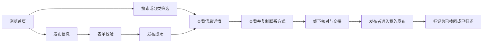

# 拾光 · 校园寻物启事

“拾光”是一个使用原生微信小程序技术实现的校园失物招领应用。用户可以发布寻物或招领信息，通过关键词、信息类型和物品分类组合查找线索，并完成查看详情、联系发布者、收藏和更新状态的完整流程。

## 本地版与云端版

- 仓库根目录：现有本地演示版，运行方式和功能保持不变。
- [cloud-version/](cloud-version/README.md)：独立云开发版，当前第 2 / 6 批，已迁入配置、云函数、数据接口与后端测试，暂不能单独运行；后续按计划补齐应用入口与页面。
- [迁移计划与实际记录](docs/cloud-migration-plan.md)：记录真实批次、时间、测试及交付状态。

两个版本需分别导入各自项目目录。根目录项目已排除云端目录，避免将两个小程序混在一个包内。

## 项目成员与分工

| 成员 | 主要工作 |
| --- | --- |
| 成员 A（待填写） | 首页信息流、搜索筛选、详情页、本地数据层、单元测试 |
| 成员 B（待填写） | 发布流程、个人中心、我的发布、页面视觉、文档整理 |

## 核心功能

- 寻物启事和失物招领两种发布类型
- 按关键词、类型和分类组合搜索
- 发布信息、图片选择、表单校验和草稿自动保存
- 详情查看、联系方式弹层、复制联系信息和安全提示
- 收藏线索并在个人中心统一查看
- “我的发布”按状态筛选，可标记解决或重新开启
- 状态语义区分：寻物中、招领中、已找回、已归还
- 微信本地存储持久化，无需后台即可完整演示

## 使用流程



## 运行方式

1. 安装并打开微信开发者工具。
2. 选择“导入项目”，项目目录选择本仓库根目录。
3. AppID 可使用测试号；`project.config.json` 已配置为 `touristappid`。
4. 点击“编译”，即可在模拟器中预览。
5. 首次运行会自动写入 5 条演示信息；可在个人中心恢复演示数据。

## 单元测试

项目使用 Node.js 自带的 `node:test`，不需要安装第三方依赖。

```bash
npm test
npm run check
```

当前测试覆盖：初始化、发布、文本清理、分类图标、状态更新、收藏、我的发布、删除、用户资料及恢复演示数据。

## 目录结构

```text
小程序/
├─ app.js / app.json / app.wxss     # 全局入口、页面注册与公共样式
├─ components/
│  ├─ bottom-nav/                   # 底部导航
│  ├─ empty-state/                  # 空状态
│  └─ item-card/                    # 信息卡片
├─ pages/
│  ├─ home/                         # 首页、搜索与筛选
│  ├─ publish/                      # 发布信息与草稿保存
│  ├─ detail/                       # 详情、联系与收藏
│  ├─ success/                      # 发布成功反馈
│  ├─ profile/                      # 个人中心
│  ├─ login/                        # 本地演示登录
│  ├─ my-posts/                     # 我的发布与状态维护
│  └─ favorites/                    # 我的收藏
├─ utils/store.js                   # 本地数据访问层
├─ tests/store.test.js              # 数据层单元测试
├─ docs/                            # PSP、设计说明和提交清单
└─ package.json                     # 测试与静态检查命令
```

## 数据说明

课程演示版使用 `wx.setStorageSync` 保存数据。页面只调用 `utils/store.js`，没有直接操作存储，因此将来接入微信云开发数据库或自建 API 时，主要替换数据层即可。

## 作业材料

- [PSP 时间记录](docs/PSP.md)
- [设计实现与测试报告](docs/作业报告.md)
- [GitHub 协作与提交清单](docs/GitHub协作与提交清单.md)

## 已知限制

- 当前账号和数据只保存在本机，不代表真实校园身份认证。
- 图片使用微信临时文件路径，课程演示足够；正式上线应上传到云存储。
- 联系和物品交接在线下完成，小程序只提供信息匹配与状态维护。
