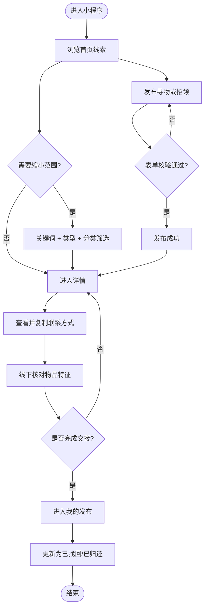
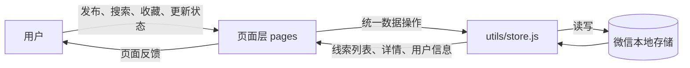

# 拾光校园寻物启事——设计实现与测试报告

## 1. 项目链接

- 成员 A 博客：`待填写`
- 成员 B 博客：`待填写`
- GitHub 仓库：`待填写`
- Pull Request：`待填写`

## 2. 具体分工

| 成员 | 分工 |
| --- | --- |
| 成员 A（待填写） | 首页信息流、搜索筛选、详情页、数据层和单元测试 |
| 成员 B（待填写） | 发布流程、个人中心、我的发布、视觉优化和文档 |

两位成员共同完成需求讨论、原型复审、联调和最终验收。实际提交前请按 GitHub 记录调整本表，避免分工与提交历史不一致。

## 3. PSP 表格

完整记录见 [PSP.md](PSP.md)。本次没有把估计时间和实际时间写成相同数字，而是结合状态逻辑返工、草稿功能和测试工作记录偏差。

## 4. 解题思路与设计实现

### 4.1 产品目标

校园失物信息通常分散在群聊中，容易被新消息覆盖。项目将信息统一为结构化的“线索”，重点解决发布、查找、联系和结束信息四个环节。本次不实现复杂后台、地图定位和真实认证，将精力集中在核心流程的清晰与可用性上。

### 4.2 数据结构

每条信息包含：编号、类型、标题、分类、描述、地点、日期、联系方式、状态、发布者、发布时间、图片和收藏状态。`type` 使用 `lost/found`，`status` 使用 `open/closed`，避免把“捡到”和“已经解决”混为一谈。

```js
const item = {
  id: `local-${Date.now()}`,
  type: payload.type,
  title: payload.title.trim(),
  category: payload.category,
  status: 'open',
  favorite: false,
  mine: true
}
```

### 4.3 关键流程图



### 4.4 数据流图



### 4.5 搜索与组合筛选

首页先分别判断信息类型和分类，再将标题、描述、地点、分类合并为可搜索文本。三个条件可以同时生效。

```js
const filteredItems = allItems.filter((item) => {
  const matchType = currentType === 'all' || item.type === currentType
  const matchCategory = currentCategory === '全部' || item.category === currentCategory
  const text = `${item.title} ${item.description} ${item.location} ${item.category}`.toLowerCase()
  return matchType && matchCategory && (!query || text.includes(query))
})
```

### 4.6 状态闭环

发布者可在“我的发布”把进行中的信息标记为解决，也可以重新开启。界面根据类型显示不同结果：寻物信息关闭后为“已找回”，招领信息关闭后为“已归还”，防止用户继续进行无效联系。

### 4.7 草稿自动保存

发布页每次修改类型、文本、分类、日期或图片时都会保存草稿。再次进入页面时自动恢复；发布成功后删除草稿，兼顾误退出恢复和数据清理。

## 5. 附加特点与展示

1. **组合筛选**：关键词、类型和分类可同时使用，减少查找成本。
2. **清晰状态语义**：区分寻物中、招领中、已找回、已归还。
3. **隐私友好的联系方式**：首页不直接展示联系方式，只在详情弹层中查看和复制。
4. **草稿恢复**：填写途中退出后可以继续编辑。
5. **演示数据与一键恢复**：无需后台也能复现完整使用流程，适合助教验收。
6. **一致的视觉系统**：深绿色作为主色，黄色强调行动，卡片、圆角和间距统一。

## 6. 目录与使用说明

目录结构、运行步骤和数据说明见仓库根目录 [README.md](../README.md)。助教导入微信开发者工具后点击“编译”即可复现。

## 7. 单元测试

### 7.1 工具与学习方式

测试使用 Node.js 内置的 `node:test` 与 `assert`，无需 Jest 等第三方依赖。通过模拟 `wx.getStorageSync`、`wx.setStorageSync` 和 `wx.removeStorageSync`，在电脑上独立验证数据层。

### 7.2 测试用例

| 编号 | 场景 | 测试数据 | 预期结果 |
| --- | --- | --- | --- |
| 1 | 首次初始化 | 空存储 | 写入 5 条演示数据，重复执行不重复添加 |
| 2 | 发布寻物 | 标题和地点带首尾空格 | 文本被清理，状态为 `open` |
| 3 | 分类展示 | 分类为“书籍文具” | 自动使用书籍图标 |
| 4 | 状态更新 | `open → closed → open` | 两次更新均可查询到正确状态 |
| 5 | 收藏切换 | 同一条信息连续点击两次 | `false → true → false` |
| 6 | 我的发布 | 演示数据 + 新发布 | 只返回本地新增的信息 |
| 7 | 删除信息 | 删除新发布编号 | 再次查询得到 `undefined` |
| 8 | 用户生命周期 | 保存用户后退出 | 可读取用户，退出后为 `null` |
| 9 | 恢复演示数据 | 演示数据 + 新发布 | 恢复为 5 条，个人发布清空 |

### 7.3 测试数据设计

- 使用带空格的输入验证文本清理。
- 覆盖寻物和招领共同使用的数据字段。
- 覆盖打开、关闭、重新开启的状态变化。
- 每个测试前清空模拟存储，避免用例互相污染。
- 测试人员无需理解微信界面，只要运行 `npm test` 即可复现结果。

## 8. GitHub 签入记录

最终博客中应放入仓库提交记录截图和 Pull Request 截图。提交信息应描述实际内容，例如：

- `feat: 修正线索状态并加入发布草稿`
- `test: 增加本地数据层单元测试`
- `docs: 完善运行说明和课程作业报告`

不要只写 `update`、`修改` 等无法说明内容的提交信息。

## 9. 遇到的问题与解决方法

### 问题一：发布后状态文字容易产生歧义

最初只根据 `lost/found` 显示标签，已解决的信息仍可能显示“寻物中/招领中”。后来把状态和类型组合判断，关闭后的寻物显示“已找回”，关闭后的招领显示“已归还”。收获是界面文案也属于业务逻辑，不能只改颜色。

### 问题二：页面直接操作存储导致逻辑分散

尝试过在各页面分别读写本地存储，但收藏和状态更新容易重复。最终把所有操作集中在 `utils/store.js`，页面只负责展示和交互。这样也使数据层可以脱离微信界面进行单元测试。

### 问题三：表单中途退出会丢失内容

最初仅在点击发布时保存数据。后来在输入、分类、日期和图片变化时保存草稿，进入页面时恢复，发布成功后清除。收获是异常路径也需要纳入核心流程。

## 10. 结对评价

### 值得学习的地方

- `待结合队友实际贡献填写，例如：页面视觉统一、沟通及时、测试细致。`

### 需要改进的地方

- `待结合真实合作情况填写，例如：提交粒度、任务估时或文档同步。`
